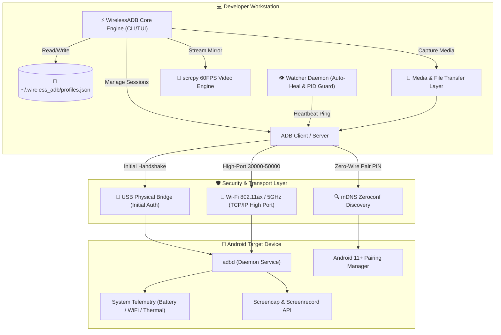
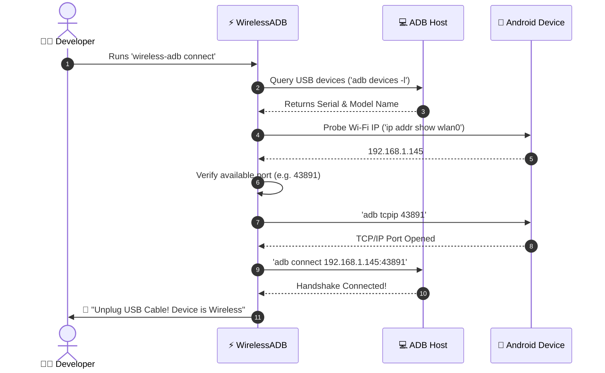
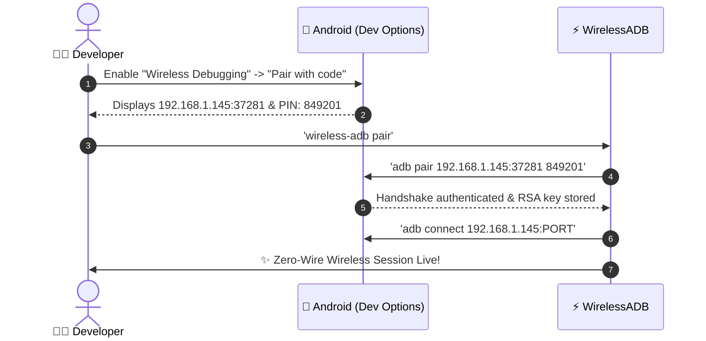

# ⚡ WirelessADB

<div align="center">

```
  ██╗    ██╗██╗██████╗ ███████╗██╗     ███████╗███████╗███████╗     █████╗ ██████╗ ██████╗ 
  ██║    ██║██║██╔══██╗██╔════╝██║     ██╔════╝██╔════╝██╔════╝    ██╔══██╗██╔══██╗██╔══██╗
  ██║ █╗ ██║██║██████╔╝█████╗  ██║     █████╗  ███████╗███████╗    ███████║██║  ██║██████╔╝
  ██║███╗██║██║██╔══██╗██╔══╝  ██║     ██╔══╝  ╚════██║╚════██║    ██╔══██║██║  ██║██╔══██╗
  ╚███╔███╔╝██║██║  ██║███████╗███████╗███████╗███████║███████║    ██║  ██║██████╔╝██████╔╝
   ╚══╝╚══╝ ╚═╝╚═╝  ╚═╝╚══════╝╚══════╝╚══════╝╚══════╝╚══════╝    ╚═╝  ╚═╝╚═════╝ ╚═════╝ 
```

### **The Next-Gen Wireless Android Debugging, Telemetry & Device Management Suite**
*Cut the cables. Stay secure. Debug at lightspeed.* 🚀🔥

[](https://github.com/taezeem14/WirelessADB/stargazers)
[](LICENSE)
[](https://python.org)
[](https://github.com/taezeem14/WirelessADB)
[-ff007f.svg?style=for-the-badge)](https://github.com/taezeem14/WirelessADB)
[](https://github.com/taezeem14/WirelessADB/releases)

[Key Features](#-key-features) • [Quick Install](#-one-line-install) • [Interactive TUI](#-interactive-tui--cli-showcase) • [Architecture](#-system-architecture) • [Command Reference](#-command-matrix) • [Guides](#-documentation--guides)

</div>

---

## 💡 Why WirelessADB?

Vanilla `adb tcpip 5555` is **painful, slow, and insecure**:
- 💀 **Fixed Port 5555**: A massive neon sign for LAN port scanners and malware.
- 🔌 **Tethered Hell**: Endless plugging/unplugging cables just to fetch your IP.
- 👻 **Ghost Disconnects**: Wi-Fi blips kill your session with zero auto-recovery.
- 💤 **Zero Telemetry**: No clue about battery percentage, network latency, or link speed.
- 🐌 **Fragmented Workflow**: Separate ad-hoc commands for screenshots, screen recording, file transfers, and app debugging.

### 🔥 Enter WirelessADB v4.0
**WirelessADB** transforms ADB into a high-octane, interactive developer console. It automates random high-port negotiation (30000–50000), enables **Android 11+ zero-wire Wi-Fi pairing**, captures HD screenshots & screen records, pushes/pulls files, streams live logcat, monitors real-time telemetry, launches 60 FPS `scrcpy` mirroring in 1 keystroke, and auto-heals dropped connections in the background.

---

## ⚡ Comparison: Vanilla ADB vs WirelessADB

| Feature | 🚫 Vanilla `adb` | ⚡ WirelessADB Suite v4.0 |
| :--- | :---: | :---: |
| **Port Security** | Hardcoded `5555` (Known CVE target) | **Dynamic High-Port (30000–50000)** 🛡️ |
| **Android 11+ Zero-Cable Pairing** | Manual multi-step PIN CLI | **One-Step Guided Wizard (`pair`)** 📱 |
| **Interactive Terminal Menu** | ❌ None | **Full Cyberpunk TUI Dashboard (`menu`)** 🎨 |
| **Auto-Reconnect Watcher** | ❌ Manual retry | **Background Daemon Auto-Heal (`watch`)** 🔄 |
| **Device Screenshot Capture** | Complex raw pipe syntax | **One-Click Instant PNG (`screenshot`)** 📸 |
| **Screen Video Recording** | Manual timeout flags & pulling | **Automated Screen Record (`record`)** 🎥 |
| **Fast File Transfer** | Verbose paths | **Streamlined Push & Pull (`push`/`pull`)** 📂 |
| **App Management** | Raw `pm` shell syntax | **Categorized Package Lister (`apps`)** 📱 |
| **Live Logcat Streaming** | Unfiltered dump | **Filtered Real-time Logcat (`logcat`)** 📋 |
| **Live Battery & Thermal Meters** | ❌ None | **Real-time % / State / Temp HUD** 🔋 |
| **Network Latency & Signal RSSI** | ❌ None | **Live Ping (ms) & Subnet Guard** 📶 |
| **One-Click Screen Mirror** | ❌ Manual scrcpy flags | **Optimized 60 FPS Screen Mirror (`mirror`)** 🖥️ |
| **Device Aliases & Favorites** | ❌ None | **Named Device Profiles (`favorites`)** ⭐ |
| **Device Reboot Manager** | Raw flags | **Interactive Bootloader / Recovery (`reboot`)** 🔄 |
| **Zero Dependencies** | N/A | **100% Pure Python Standard Library** 📦 |

---

## 🚀 One-Line Install

### 🪟 Windows (PowerShell — Recommended)
```powershell
iex (irm https://raw.githubusercontent.com/taezeem14/WirelessADB/main/install.ps1)
```
> *Or using the pipeline syntax:*
> ```powershell
> irm https://raw.githubusercontent.com/taezeem14/WirelessADB/main/install.ps1 | iex
> ```

*Or in Command Prompt (CMD):*
```cmd
curl -fsSL https://raw.githubusercontent.com/taezeem14/WirelessADB/main/install_windows.bat -o install.bat && install.bat
```

### 🐧 Linux (Bash / Zsh)
```bash
curl -fsSL https://raw.githubusercontent.com/taezeem14/WirelessADB/main/install_linux.sh | bash
```

### 🍏 macOS (Homebrew / Terminal)
```bash
curl -fsSL https://raw.githubusercontent.com/taezeem14/WirelessADB/main/install_macos.sh | bash
```

### 🐍 Pip / Pipx
```bash
pip install git+https://github.com/taezeem14/WirelessADB.git
```

---

## 🎮 Interactive TUI & CLI Showcase

Launch the interactive control center anytime by simply typing:
```bash
wireless-adb
# or using the ultra-fast alias:
wadb
```

```
╭─ ⚡ WIRELESS ADB CONTROL CENTER ────────────────────────────╮
│ Status: 1 Wireless | 0 USB                                  │
│                                                             │
│   [1] ⚡ Connect USB Device to Wireless (Auto High-Port)     │
│   [2] 📱 Pair via Android 11+ Wi-Fi (No Cable Needed)       │
│   [3] 📊 Live Status Dashboard & Latency HUD                │
│   [4] 🔄 Quick Reconnect to Last Device                     │
│   [5] 🔍 Deep Device Telemetry (Battery, CPU, Wi-Fi)        │
│   [6] 📸 Capture Device Screenshot                          │
│   [7] 🎥 Record Device Screen Video                         │
│   [8] 🚀 Launch scrcpy 60FPS Screen Mirror                  │
│   [9] 💻 Open Wireless Terminal Shell                       │
│   [A] 📦 Install APK Wireless                               │
│   [B] 📂 Push / Pull File Transfer                          │
│   [C] 📱 List Installed Apps & Packages                     │
│   [D] 📋 Live Logcat Streamer                               │
│   [E] 📡 Scan Network for ADB Devices                       │
│   [F] ⭐ Manage Device Favorites & Aliases                  │
│   [G] 🔄 Reboot Device (System / Bootloader / Recovery)     │
│   [H] 🩺 Run Doctor Health Diagnostics                      │
│   [0] 🔌 Disconnect & Clean Up All Sessions                 │
│   [q] 🚪 Quit                                               │
╰─────────────────────────────────────────────────────────────╯
```

---

## 🏗️ System Architecture



---

## 🔄 Connection Workflows

### 1. Standard USB-to-Wireless Auto-Handshake


### 2. Android 11+ Zero-Cable Wi-Fi Pairing


---

## 📋 Command Matrix

| Command | Shorthand | Description |
| :--- | :---: | :--- |
| `wireless-adb` | `wadb` | Launch full interactive TUI Control Center. |
| `wireless-adb connect` | `wadb connect` | Switch USB device to secure high-port wireless mode. |
| `wireless-adb pair` | `wadb pair` | Android 11+ zero-wire Wi-Fi pairing wizard. |
| `wireless-adb status` | `wadb status` | Live dashboard with latency pings and battery meters. |
| `wireless-adb reconnect`| `wadb reconnect`| Reconnect instantly to last known device or alias. |
| `wireless-adb screenshot`| `wadb screenshot`| Capture HD device screenshot (`-o <path>`). |
| `wireless-adb record` | `wadb record` | Record screen video (`--time <sec> -o <path>`). |
| `wireless-adb push <src> <dst>` | `wadb push` | Push local file or folder to device. |
| `wireless-adb pull <src> [dst]` | `wadb pull` | Pull file or folder from device to host. |
| `wireless-adb apps` | `wadb apps` | List installed applications (`--system`, `--filter <kw>`). |
| `wireless-adb logcat` | `wadb logcat` | Stream live device logs (`--tag <name>`, `-o <file>`). |
| `wireless-adb reboot` | `wadb reboot` | Reboot device (`--bootloader`, `--recovery`). |
| `wireless-adb favorites`| `wadb favorites`| Manage device profiles, aliases, and saved targets. |
| `wireless-adb info` | `wadb info` | Deep device telemetry (RAM, CPU ABI, battery %, WiFi RSSI). |
| `wireless-adb mirror` | `wadb mirror` | Instant 60 FPS low-latency screen mirror via `scrcpy`. |
| `wireless-adb shell` | `wadb shell` | Direct interactive wireless terminal shell. |
| `wireless-adb install <apk>` | `wadb install` | Wireless fast APK installer. |
| `wireless-adb scan` | `wadb scan` | Scan local subnet and mDNS for active ADB endpoints. |
| `wireless-adb watch` | `wadb watch` | Run auto-reconnection daemon for dropped Wi-Fi sessions. |
| `wireless-adb doctor` | `wadb doctor` | Pre-flight diagnostics (ADB, Python, PATH, permissions). |
| `wireless-adb disconnect`| `wadb disconnect`| Disconnect all wireless sessions and reset to USB mode. |

---

## 🔒 Security-First Architecture

Wireless ADB inherently exposes a shell port over your local Wi-Fi. WirelessADB implements **defense-in-depth**:

```
 ┌─────────────────────────────────────────────────────────────┐
  │               WIRELESSADB SECURITY SHIELD                   │
  ├─────────────────────────────────────────────────────────────┤
  │  🛡️ Dynamic Port Obfuscation : Random 30000-50000 range      │
  │  🛡️ Subnet Isolation Guard  : Detects cross-VLAN leaks      │
  │  🛡️ Zero-Residual Disconnect: Hard TCP reset to USB-only     │
  │  🛡️ Ephemeral RSA Pairing   : Full Android 11 TLS crypt     │
  │  🛡️ Singleton PID Lock      : Prevents daemon collisions    │
  └─────────────────────────────────────────────────────────────┘
```

1. **Port Obfuscation**: Eliminates default port `5555`, preventing automated mass-scanners on coffee shop / office Wi-Fi from detecting your device.
2. **Subnet Verification**: Checks host IPv4 and device IPv4 masks to warn if your device is inadvertently exposed to an unexpected subnet or public interface.
3. **Clean Teardown**: `wireless-adb disconnect` resets the phone's daemon back to USB-only mode, closing any listening TCP sockets.

---

## 📚 Documentation & Guides

- 🚀 [Quickstart Guide](QUICKSTART.md) — 60-second setup and commands.
- 💡 [Examples & CLI Recipes](EXAMPLES.md) — Real-world workflow examples.
- 🛡️ [Security Whitepaper](SECURITY.md) — Threat model and security recommendations.
- 📊 [Project Architecture Summary](PROJECT_SUMMARY.md) — Internal design and module map.

---

## 🧪 Developer Recipes

### ⚛️ React Native & Expo
```bash
# Connect wirelessly, then start Metro bundler
wireless-adb connect
npx react-native run-android
```

### 💙 Flutter
```bash
wireless-adb connect
flutter devices
flutter run
```

### 📱 Android Studio
Once connected with `wireless-adb connect`, Android Studio will instantly detect your device in the **Running Devices / Target Device** dropdown!

---

## 🤝 Contributing

Contributions make the open-source community an amazing place to learn, inspire, and create. Any contributions you make are **greatly appreciated**.

1. Fork the Project
2. Create your Feature Branch (`git checkout -b feature/EpicFeature`)
3. Commit your Changes (`git commit -m 'feat: Add EpicFeature'`)
4. Push to the Branch (`git push origin feature/EpicFeature`)
5. Open a Pull Request

---

## 📜 License & Credits

Distributed under the **MIT License**. See [LICENSE](LICENSE) for more information.

Crafted with ❤️ by **[Muhammad Taezeem Tariq](https://github.com/taezeem14)**. <br>
If you like this project, please consider giving it a ⭐ on GitHub!
